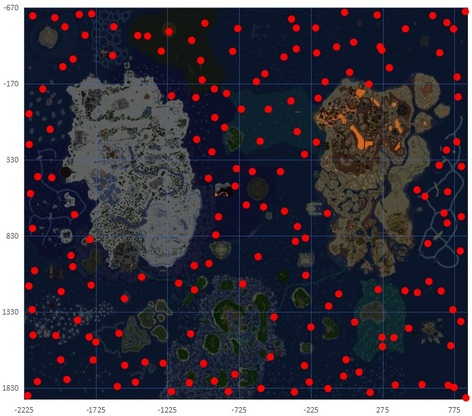

# Lootrunning
This code tries to find the fastest path of some nodes from an image. 

Every red circles are nodes of the graph that is gonna be created, and after getting the shortest path. 
Every point is between y=[-655, 1900] x=[-2222, 860], the coordinates displayed the map are not accurate. 
I do not own the original image, so i cannot change this imprecision. 
Said this, the red circles coordinates are gonna get with 2 methods:
1) Map coordinates by getting the average x, y of each circle
2) From a list of coordinates, where every coordinate represent a pair of precise coordinates. 

Point 2 is something i'm doing manually, so till i have the full list of coordinates 
I have to use also 1)

From this i create a graph, and from this graph i try to find the fastest path to reach every point.

For now i coded just 1 algorithm for this: a modified version of the greedy algorithm. 
You can read how this is modified in chestManager.py function calculateGreedyBruteforce 
A little resume is that it's a greedy algorithm that, at the same time try to find every possible combinations. 
With this said, every possible combinations are n! - greedy factor that i dont know. 
And since there are 169 nodes in total, it's a little under 169!... Yes i'm thinking about changing it with something else.
